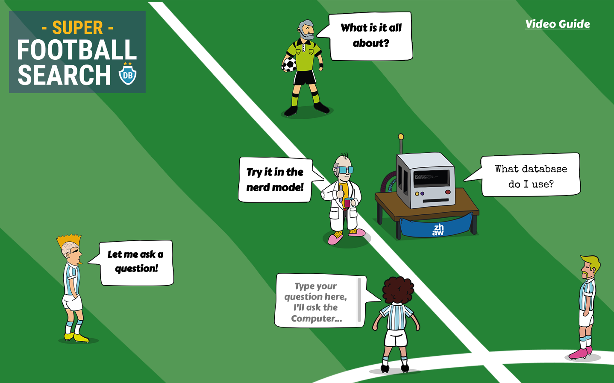

# FootballDB: Exploring NL-to-SQL Systems in the Real-World

This repository contains both the data and code to reproduce the results of our VLDB submission "FootballDB: Exploring NL-to-SQL Systems in the Real-World" (Fuerst, Kosten, Nooralahzadeh, Zhang, & Stockinger).

## Data and Code.

- [`./data/FootballDB`](./data/FootballDB) contains PostgreSQL database for each data model (v1, v2, v3) as well as the train and test data for each data model. The train data is provided in different splits of 100, 200 and 300 NL-SQL pairs.
- [`./data/results`](./data/results) contains the results for each of the 5 evaluated NL-to-SQL systems, for each data model and for each split.
- [`./src/train`](.src/train) contains the source code and/or instructions how to train each evaluated NL-to-SQL system and evaluate it against the respective test data set.
- [`./src/analysis`](./src/analysis) contains the source code to analyse the obtained results. It reproduces the plots that are also contained in the paper.
